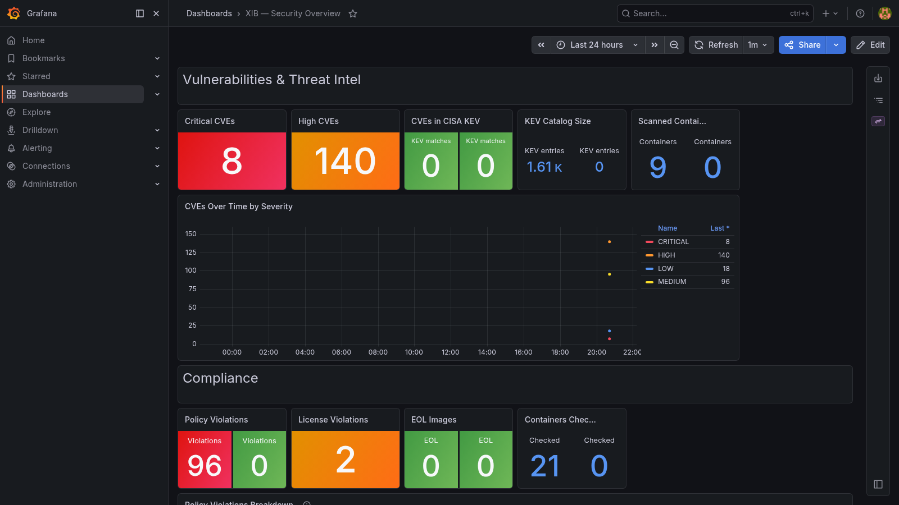

# XIB — Security in a Box

Umbrella project that composes all **in-a-box** security tools into a single stack with a unified Grafana posture dashboard.

XIB can run through Docker Compose or as a portable Kubernetes deployment. The
Kubernetes chart includes standalone, existing-platform, and air-gapped
profiles; see [Kubernetes and air-gapped deployment](docs/kubernetes-airgap.md).
For the operating model and complete deployment lifecycle, see the
[XIB Concept of Operations](docs/CONOPS.md).



```
make up
```

That starts VIB, CIB, TIB, VictoriaMetrics, and the unified Grafana. The PIB
and IIB monitors are optional profiles because they require TLS targets or an
existing Authentik deployment.

The Compose deployment is self-contained: it uses the same immutable images
as Kubernetes and does not require Git submodules.

---

## Architecture

```
xib/
├── vib/   ← Vulnerability in a Box  (Trivy scanner + CVE metrics)
├── tib/   ← Threat Intel in a Box   (CISA KEV + EPSS cross-reference)
├── cib/   ← Compliance in a Box     (SBOM, license, EOL, container policy)
├── iib/   ← Identity in a Box       (Authentik IdP, login metrics)
├── pib/   ← PKI in a Box            (step-ca, TLS cert expiry monitor)
└── ...    ← XIB Grafana (unified dashboard, all 5 datasources)
```

The Docker deployment is defined entirely in this repository and connects all collectors to one VictoriaMetrics service and one provisioned Grafana service.

---

## Quick start

```bash
git clone https://github.com/iareanthony/xib.git
cd xib
make up
```

### Kubernetes

```bash
helm upgrade --install xib ./k8s -n xib-system --create-namespace
```

For a disconnected cluster, prepare the image archive on a connected staging
machine with `airgap/export-images.ps1`, transfer the resulting bundle, mirror
or load the images, and install with `airgap/install.ps1`.

Open **http://localhost:3000** — the XIB Security Overview dashboard loads automatically.

Optional monitors can be enabled after their settings are added to `.env`:

```bash
docker compose --profile pki --profile identity up -d
```

---

## Configuration

Sub-project `.env` files are created automatically from their `.env.example` templates on first `make up`. Secrets (Authentik keys, tokens, passwords) are auto-generated.

To customise the unified Grafana:

```bash
cp .env.example .env
# Edit XIB_GRAFANA_PASSWORD
make up
```

---

## Unified dashboard

The **XIB Security Overview** (`uid: xib-overview`) aggregates data from all five tools:

**Vulnerabilities & Threat Intel** (VIB + TIB)
- Critical / High CVE counts
- CVEs matched in CISA KEV catalog
- CVEs over time by severity

**Compliance** (CIB)
- Container policy violations
- License violations
- EOL components
- Containers checked

**Identity & PKI** (IIB + PIB)
- Active users, login failures
- Certs expiring within 30 days, expired certs
- Cert days remaining over time
- Login events over time

**Sync Status**
- Last sync timestamp for all five tools

---

## Makefile targets

| Target | Description |
|--------|-------------|
| `make up` | Start the full stack (runs setup first) |
| `make down` | Stop the full stack |
| `make restart` | Restart all services |
| `make build` | Rebuild all custom images |
| `make logs` | Follow all service logs |
| `make setup` | Create sub-project .env files and generate secrets |
| `make update` | Pull latest commits on all submodules |
| `make pull-submodules` | Init/clone submodules (for repos checked out without --recurse-submodules) |
| `make clean` | Stop everything and delete all volumes |

---

## Updating sub-projects

Each sub-project is pinned to a specific commit. To move all submodules to their latest `master`:

```bash
make update
make up
```

To update a single sub-project:
```bash
git submodule update --remote --merge vib
```

---

## Running tools standalone

Every sub-project is independently deployable:

```bash
cd vib
make up
```

XIB adds no dependencies to the individual tools — they function identically with or without the umbrella.

---

## License

MIT
